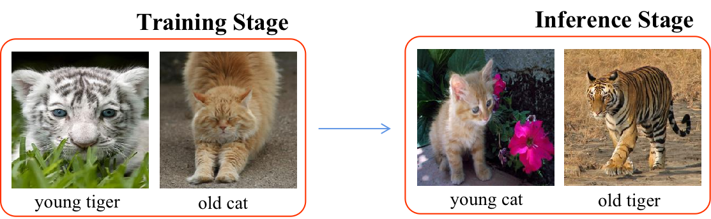

# Awesome Compositional Zero-Shot Learning
Compositional Zero-Shot Learning (CZSL) aims to recognize unseen concepts composited of learned state and object primitives. Specifically, given *old tiger* and *young cat* in the training stage, we need to identify *young tiger* and *old cat* during inferencing. 

# Contents

- [Datasets](#datasets)
- [Papers](#papers)

# Datasets
### MIT-States
* [paper](https://ieeexplore.ieee.org/stamp/stamp.jsp?tp=&arnumber=7298744)
* [download](http://web.mit.edu/phillipi/Public/states_and_transformations/index.html)

### UT-Zappos
* [paper](https://ieeexplore.ieee.org/stamp/stamp.jsp?tp=&arnumber=6909426)
* [download](https://vision.cs.utexas.edu/projects/finegrained/utzap50k/)

### C-GQA
* [paper](https://openaccess.thecvf.com/content/CVPR2021/papers/Naeem_Learning_Graph_Embeddings_for_Compositional_Zero-Shot_Learning_CVPR_2021_paper.pdf)
* [download](https://github.com/ExplainableML/czsl)

### AO-CLEVr
* [paper](https://proceedings.neurips.cc/paper/2020/hash/1010cedf85f6a7e24b087e63235dc12e-Abstract.html)
* [download](https://github.com/nv-research-israel/causal_comp)

### VAW-CZSL
* [paper](https://arxiv.org/pdf/2205.08536.pdf)
* [download](https://github.com/nirat1606/OADis)

### Compositional PartNet
* [paper](https://arxiv.org/pdf/2111.14673)
* [download](https://github.com/ferjad/3DCZSL)

#  Papers

### 2023
* Distilled Reverse Attention Network for Open-world Compositional Zero-Shot Learning, *arxiv2023*.[[paper]](https://arxiv.org/pdf/2303.00404.pdf)

* Isolating Features of Object and Its State for Compositional Zero-Shot Learning, *TETCI2023*.[[paper]](https://ieeexplore.ieee.org/document/10015197)

* Learning Attention Propagation for Compositional Zero-Shot Learning, *WACV2023*.[[paper]](https://openaccess.thecvf.com/content/WACV2023/papers/Khan_Learning_Attention_Propagation_for_Compositional_Zero-Shot_Learning_WACV_2023_paper.pdf)

* Learning to Compose Soft Prompts for Compositional Zero-Shot Learning, *ICLR2023*. [[paper]](https://arxiv.org/pdf/2204.03574.pdf)[[code]](https://github.com/BatsResearch/csp)

* Decomposed Soft Prompt Guided Fusion Enhancing for Compositional Zero-Shot Learning, *CVPR2023*.[[paper]](https://arxiv.org/pdf/2211.10681.pdf)[[code]](https://github.com/Forest-art/DFSP)

### 2022
* A Decomposable Causal View of Compositional Zero-Shot Learning, *TMM2022*.[[paper]](https://ieeexplore.ieee.org/document9864072metrics#metrics)[[code]](https://github.com/muliyangm/DeCa)
* KG-SP: Knowledge Guided Simple Primitives for Open World Compositional Zero-Shot Learning, *CVPR2022*.[[paper]]( http://arxiv.org/pdf/2205.06784)[[code]](https://github.com/explainableml/kg-sp)
* Disentangling Visual Embeddings for Attributes and Objects, *CVPR2022*.[[paper]](https://arxiv.org/pdf/2205.08536.pdf)[[code]](https://github.com/nirat1606/oadis)
* Siamese Contrastive Embedding Network for Compositional Zero-Shot Learning, *CVPR2022*.[[paper]](https://openaccess.thecvf.com/content/CVPR2022/papers/Li_Siamese_Contrastive_Embedding_Network_for_Compositional_Zero-Shot_Learning_CVPR_2022_paper.pdf)[[code]](https://github.com/XDUxyLi/SCEN-master)
* On Leveraging Variational Graph Embeddings for Open World Compositional Zero-Shot Learning, *ACMMM2022*.[[paper]](https://arxiv.org/abs/2204.11848)
* 3D Compositional Zero-shot Learning with DeCompositional Consensus, *ECCV2022*.[[paper]](https://arxiv.org/pdf/2111.14673.pdf)[[code]](https://github.com/ferjad/3DCZSL)
* Learning Invariant Visual Representations for Compositional Zero-Shot Learning, *ECCV2022*.[[paper]](https://arxiv.org/pdf/2206.00415.pdf)[[code]](https://github.com/PRIS-CV/IVR)
* Learning Graph Embeddings for Open World Compositional Zero-Shot Learning, *TPAMI2022*.[[paper]](https://arxiv.org/pdf/2105.01017)
* Bi-Modal Compositional Network for Feature Disentanglement, *ICIP2022*.[[paper]](https://ieeexplore.ieee.org/document/9897457)

### 2021
* Learning Graph Embeddings for Compositional Zero-Shot Learning, *CVPR2021*.[[paper]](https://openaccess.thecvf.com/content/CVPR2021/papers/Naeem_Learning_Graph_Embeddings_for_Compositional_Zero-Shot_Learning_CVPR_2021_paper.pdf)[[code]](https://github.com/ExplainableML/czsl)
* Open World Compositional Zero-Shot Learning, *CVPR2021*.[[paper]](https://ieeexplore.ieee.org/stamp/stamp.jsp?tp=&arnumber=9578210)[[code]](https://github.com/ExplainableML/czsl)
* Independent Prototype Propagation for Zero-Shot Compositionality, *NeurIPS2021*.[[paper]](https://arxiv.org/pdf/2106.00305.pdf)[[code]](https://github.com/FrankRuis/ProtoProp)
* Learning Single/Multi-Attribute of Object with Symmetry and Group, *TPAMI 2021*.[[paer]](https://arxiv.org/pdf/2110.04603)[[code]](https://github.com/DirtyHarryLYL/SymNet)
* Relation-aware Compositional Zero-shot Learning for Attribute-Object Pair Recognition, *TMM2021*.[[paper]](https://arxiv.org/pdf/2108.04603)[[code]](https://github.com/daoyuan98/Relation-CZSL)
* A Contrastive Learning Approach for Compositional Zero-Shot Learning, *ICMI2021*.[[paper]](https://dl.acm.org/doi/abs/10.1145/3462244.3479904)
 

### 2020
* Symmetry and Group in Attribute-Object Compositions, *CVPR2020*.[[paper]](https://openaccess.thecvf.com/content_CVPR_2020/papers/Li_Symmetry_and_Group_in_Attribute-Object_Compositions_CVPR_2020_paper.pdf)[[code]](https://github.com/DirtyHarryLYL/SymNet)
* Learning Unseen Concepts via Hierarchical Decomposition and Composition, *CVPR2020*.[[paper]](https://ieeexplore.ieee.org/stamp/stamp.jsp?tp=&arnumber=9156655)
* A causal view of compositional zero-shot recognition, *NeurIPS2020*.[[paper]](https://papers.nips.cc/paper/2020/file/1010cedf85f6a7e24b087e63235dc12e-Paper.pdf) | [[code]](https://github.com/nv-research-israel/causal_comp)
* Compositional Zero-Shot Learning via Fine-Grained Dense Feature Composition, *NeurIPS2020*.[[paper]](https://proceedings.neurips.cc/paper/2020/file/e58cc5ca94270acaceed13bc82dfedf7-Paper.pdf)[[code]](https://github.com/hbdat/neurIPS20_CompositionZSL)|

### 2019
* Adversarial Fine-Grained Composition Learning for Unseen Attribute-Object Recognition, *ICCV2019*.[[paper]](https://see.xidian.edu.cn/faculty/chdeng/Welcome%20to%20Cheng%20Deng's%20Homepage_files/Papers/Conference/ICCV2019_Kun.pdf)
* Task-Driven Modular Networks for Zero-Shot Compositional Learning, *ICCV2019*.[[paper]](https://ieeexplore.ieee.org/document/9010265)[[code]](https://github.com/facebookresearch/taskmodularnets) |
* Recognizing Unseen Attribute-Object Pair with Generative Model, *AAAI2019*.[[paper]](https://ojs.aaai.org/index.php/AAAI/article/view/4907)

### 2018
* Attributes as Operators: Factorizing Unseen Attribute-Object Compositions, *CVPR 2018*.[[paper]](https://arxiv.org/pdf/1803.09851.pdf)[[code]](https://github.com/Tushar-N/attributes-as-operators) |

### 2017
* From Red Wine to Red Tomato: Composition with Context, *CVPR2017*.[[paper]](https://ieeexplore.ieee.org/document/8099612)[[code]](https://github.com/imisra/composing_cvpr17)

